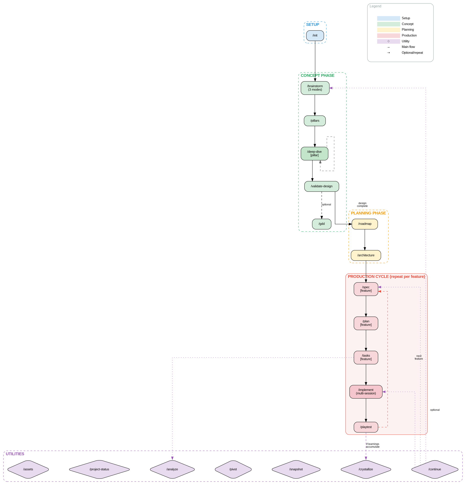
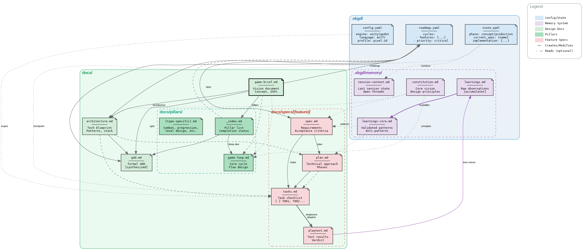
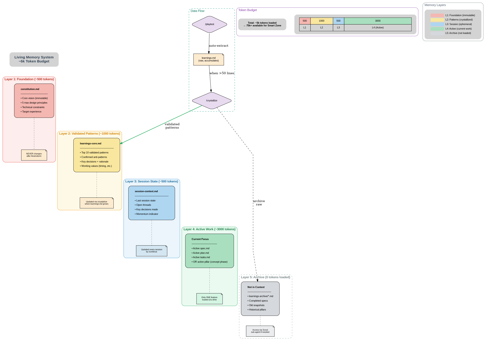

# SKGD Documentation

> Spec Kit Game Dev - AI-first workflow for solo game developers

## Quick Links

| Resource | Description |
|----------|-------------|
| [Main README](../README.md) | Installation, quick start, overview |
| [CONTRIBUTING](../CONTRIBUTING.md) | How to contribute |
| [Tutorial](tutorial/00-overview.md) | Complete step-by-step walkthrough |

---

## Tutorial

Learn SKGD from scratch with our comprehensive tutorial:

1. **[Overview](tutorial/00-overview.md)** - What is SKGD and how it works
2. **[Setup](tutorial/01-setup.md)** - Installation and project initialization
3. **[Concept Phase](tutorial/02-concept.md)** - Brainstorm, pillars, deep-dive
4. **[Planning Phase](tutorial/03-planning.md)** - Roadmap and architecture
5. **[Production Phase](tutorial/04-production.md)** - Spec → Plan → Tasks → Implement
6. **[Validation Phase](tutorial/05-validation.md)** - Playtest and learnings
7. **[Utilities](tutorial/06-utilities.md)** - Continue, pivot, snapshot, analyze
8. **[Troubleshooting](tutorial/07-troubleshooting.md)** - Common issues and solutions

### Reference

- **[Data Flow Appendix](tutorial/appendix-data-flow.md)** - Complete technical reference

---

## Diagrams

Visual representations of the SKGD workflow:

### Workflow Diagram
Command flow through all phases:



### File Dependencies
How files depend on each other:



### Living Memory System
The 5-layer context management:



### Source Files

| Source | Description |
|--------|-------------|
| [workflow.dot](diagrams/workflow.dot) | Graphviz source for workflow |
| [files.dot](diagrams/files.dot) | Graphviz source for dependencies |
| [memory.dot](diagrams/memory.dot) | Graphviz source for memory |

To regenerate PNGs:
```bash
dot -Tpng diagrams/workflow.dot -o diagrams/workflow.png
dot -Tpng diagrams/files.dot -o diagrams/files.png
dot -Tpng diagrams/memory.dot -o diagrams/memory.png
```

---

## Command Quick Reference

### Setup
| Command | Purpose |
|---------|---------|
| `/init` | Initialize project, verify MCP |

### Concept Phase
| Command | Purpose |
|---------|---------|
| `/brainstorm` | Creative ideation (3 modes) |
| `/pillars` | Generate design pillar stubs |
| `/deep-dive [pillar]` | Develop one pillar in depth |
| `/validate-design` | Cross-pillar coherence check |
| `/gdd` | Generate formal Game Design Document |

### Planning Phase
| Command | Purpose |
|---------|---------|
| `/roadmap` | Feature prioritization |
| `/architecture` | Project-wide technical design |

### Production Phase
| Command | Purpose |
|---------|---------|
| `/spec [feature]` | Define WHAT to build |
| `/plan [feature]` | Design HOW to build |
| `/tasks [feature]` | Generate execution checklist |
| `/implement` | Build via MCP (multi-session) |
| `/playtest` | Test and capture learnings |

### Utilities
| Command | Purpose |
|---------|---------|
| `/continue` | Smart session routing |
| `/crystallize` | Compress learnings |
| `/snapshot [v]` | Save milestone |
| `/pivot` | Handle direction change |
| `/project-status` | Dashboard |
| `/analyze` | Cross-artifact validation |
| `/assets` | Asset pipeline |

---

## File Structure

```
my-game/                    # Your project
├── .claude/commands/       # Workflow commands
├── .skgd/
│   ├── config.yaml         # Project settings
│   ├── state.yaml          # Workflow state
│   ├── roadmap.yaml        # Feature priorities
│   └── memory/             # Living Memory System
│       ├── constitution.md    # Core vision
│       ├── learnings.md       # Raw observations
│       ├── learnings-core.md  # Crystallized patterns
│       └── session-context.md # Session state
├── docs/
│   ├── game-brief.md       # Vision document
│   ├── architecture.md     # Technical blueprint
│   ├── gdd.md              # Game Design Document
│   ├── pillars/            # Design pillars
│   │   ├── _index.md
│   │   └── [pillar].md
│   └── specs/              # Feature specs
│       └── [feature]/
│           ├── spec.md
│           ├── plan.md
│           ├── tasks.md
│           └── playtest.md
└── Assets/                 # Game assets (Unity/Godot)
```

---

## Living Memory System

5-layer context management (~5k tokens):

| Layer | File | Tokens | Purpose |
|-------|------|--------|---------|
| 1 | constitution.md | ~500 | Immutable core vision |
| 2 | learnings-core.md | ~1000 | Validated patterns |
| 3 | session-context.md | ~500 | Last session state |
| 4 | Active spec/pillar | ~3000 | Current work focus |
| 5 | Archive | 0 | Not loaded (scout access) |

---

## Version History

| Version | Key Changes |
|---------|-------------|
| v3.5 | Unified `/implement`, `/gdd` command, DOT diagrams, tutorial |
| v3.4 | Scout-First pattern, auto-learnings in `/playtest` |
| v3.3 | Multi-session `/implement` with checkpoints |
| v3.2 | Design pillars system, `/pillars`, `/deep-dive` |
| v3.1 | `/architecture` command, separate `/tasks` |

---

## Need Help?

- Check [Troubleshooting](tutorial/07-troubleshooting.md)
- Open an issue on GitHub
- Read the [Data Flow Reference](tutorial/appendix-data-flow.md)

---

*SKGD v3.5 - AI-first game development*
